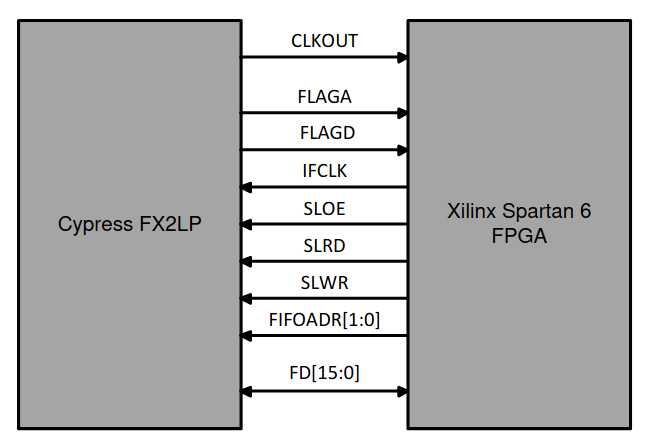
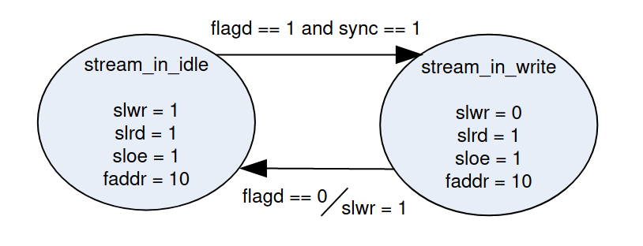

# FIFO controller project

Projeto com a finalidade de testar o envio de dados da FPGA para o PC Host

### Flags

* **FLAGA** - endpoint 2 empty flag
* **FLAGB** - endpoint 4 empty flag
* **FLAGC** - endpoint 6 full flag
* **FLAGD** - endpoint 8 full flag
* **PC0** - sync signal

### Notes

* add a reset input to the FPGA project, due to the time required for the FX2 initialize
* use 2 bits in the data package, one being the start of packet and the other the end of packet
* use parity bit to ensure the data is right

### Hardware connections

This block represents the primary connections between fpga and fx2. Also, the only remaining connection is the ADC data out.

### Diagram

some text

### Reference

* [Cypress docs](https://www.cypress.com/documentation/application-notes/an61345-designing-ez-usb-fx2lp-slave-fifo-interface)
* [FX2 Technical reference](https://www.cypress.com/documentation/technical-reference-manuals/ez-usbr-technical-reference-manual)