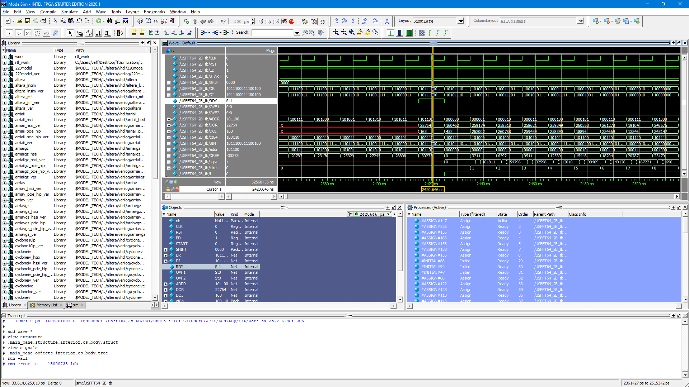

# FFT

FFT algorithm implementation on an FPGA for processing  `2^N`  points from the BINGO telescope

## FFT 64 points

The picture below shows the FFT64 simulation on ModelSim-Altera:

## Reference

* [Sistenix/FFT](https://sistenix.com/fft.html)
* [The Fast Fourier Transform (FFT)](https://www.youtube.com/watch?v=h7apO7q16V0)
* [Recursive FFT in Python Convertible to Verilog/VHDL](https://www.dsprelated.com/showcode/16.php)
* [FreeCore FFT](https://github.com/freecores/pipelined_fft_64)
