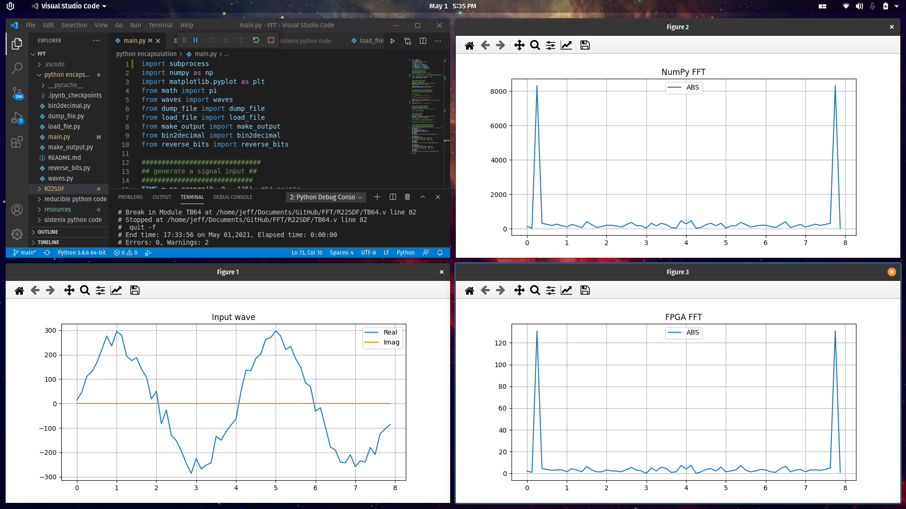
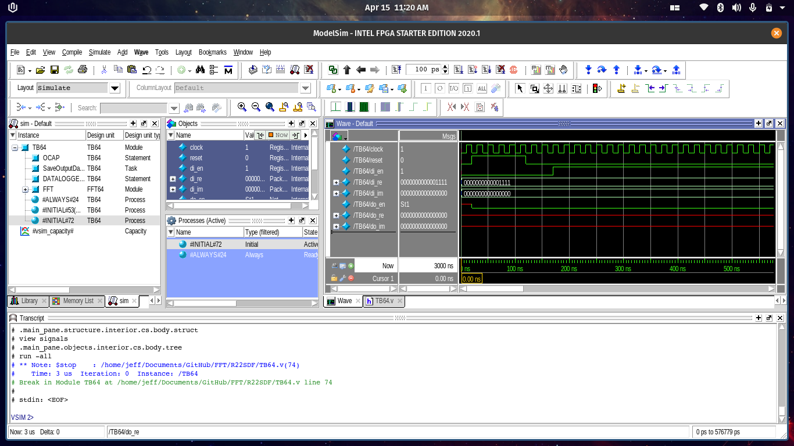

# FFT

FFT algorithm implementation on an FPGA for processing  `2^N`  points from the BINGO telescope.

# How to simulate it

## Initial settings

### Add vsim

First, you need to add ***vsim*** to your ***PATH***. So, open the terminal and type this command:

    $ sudo nano .bashrc

**NOTE:** *nano* it's just a simple terminal text editor.

Now that we are at ***bashrc*** file, you just have to include the vsim in the ***PATH*** list. For doing these, add the line bellow to the end of the file:

    export PATH=/home/$USER/intelFPGA_lite/20.1/modelsim_ase/linuxaloem:$PATH

Write the changes with ***Ctrl+O*** and ***Enter***, and then exit with ***Ctrl+X***.

### Giving permission

As we can execute ***vsim*** now, we need to give permission to ***run_vsim.sh*** do his work. So, to do that, run the command bellow at this repo directory:

    $ chmod +x run_vsim.sh

and that's it. ***run_vsim.sh*** can be executed by the python code now. Therefore, let's move on to the next settings.

### Build

If this is your first time running this project, you're going to have to build it. Start open the Quartus project at ***R22SDF/FFT.qpf***, build the project with ***Ctrl+L***, this can take several minutes. 

After that, goes to ***Tools -> Run Simulation Tool -> RTL simulation*** to open the ***ModelSim*** and build the simulation for being used in the ***run_vsim.sh*** later.

Everything is built and you just have to do that again if you modify some ***R22SDF*** files, otherwise, you can test with different input from the python code.

## Simulating

The simulation is pretty forwards, after all those settings, you just have to run the python code and test with different inputs. 

This is how it looks like:

# On ModelSim

But if you prefer, you can use ***ModelSim*** normally, like this picture below:

# Reference

* [Sistenix/FFT](https://sistenix.com/fft.html)
* [The Fast Fourier Transform (FFT)](https://www.youtube.com/watch?v=h7apO7q16V0)
* [Recursive FFT in Python Convertible to Verilog/VHDL](https://www.dsprelated.com/showcode/16.php)
* [Namake FFT](https://github.com/nanamake/r22sdf)
